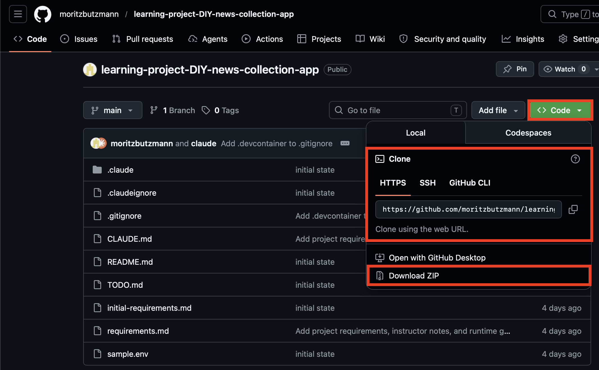
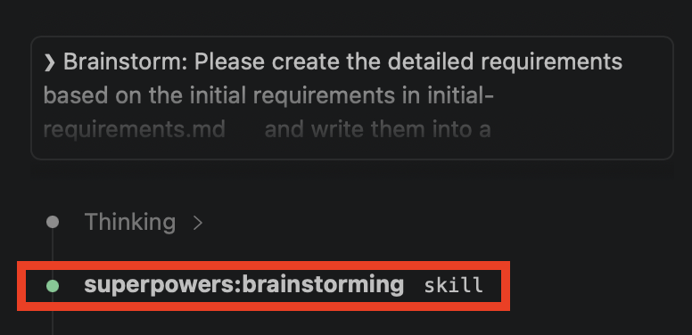

# Learning Project - DIY AI News Collector app

This is a small demo project for learning purposes, during which you will build a small application powered by AI to build your own AI powered application, which can gather news & prepare a newsletter.

## Pre-Requisites:
- Isolated environment for running claude code in yolo mode (--dangerously-skip-permissions): Either a devcontainer or in our case [ccbox](https://github.com/mk0e/ccbox)
- API-Key for Anthropic Haiku or similar small model for creating the newsletter & ranking the news

## Expected outcome of this learning experience

- hands on experience using obra super powers
- hand on experience of `vibe-coding`
- hands on experience of troubleshooting with claude code

## Steps:

### 0. Introduction & Minimal Env-Setup (5min)
- Clone this repository if you have git installed or download it as zip file and then unzip it.

- Open a terminal / shell at the location of the files and type `ccbox web` (the installation instructions can be found [here](https://github.com/mk0e/ccbox)). On Windows you need to so in the WSL2.
- This starts a web version of vs code in an isolated docker container. Follow the instructions you see in the terminal on opening the app.
- Use the open chat window for entering the prompts for following the instructions below.
- When Claude asks you any questions and you are not sure about what to reply, either go for the simplest option or ask Claude to explain it to you, e.g. on a more high level, for non-developers or from a business perspective

### 1. brainstorm your personal requirements for the app(5min)

- take a look at `initial-requirements.md`, those are the initial requirements, you can make a small adjustments if you want
- think a bit about: what requirements would you like to have?

### 2.Use the brainstorming skill of obra super powers to create a set of detailed requirements out of the bullet points (5-10min)

- If the super powers have been loaded correctly, you can just enter the following prompt and you should see something like the following:

- Prompt: `Brainstorm: Please create the detailed requirements based on the initial requirements in initial-requirements.md and write them into a requirements.md file. The requirements should should be on a functional and technical level, detailing what functionality the application should have and what technologies should be used for the implementation. The goal is to use them later for implementation. DO NOT START WITH THE IMPLEMENTATION NOW, JUST CREATE THE VERY DETAILED REQUIREMENTS YOU CAN USE LATER FOR IMPLEMENTATION`
- For the scope of this time-boxed session, pls opt for simple options in the questions you are getting asked - feel free later to make different choices
- if in doubt what to do, ask claude

### 3. Ask with obra super powers to create UI-Mockups for the website (5-10min)

- you can exit a session with `/exit` and after starting, you can resume your session with `/resume`
- Prompt: `Brainstorm: Please create me UI wireframes based on the websites and show me them either inline in the terminal or with your live-server. The UI-Design should capture all main flows and application screens. You can find the requirements in requirements.md. Please adapt the UI design until I am happy and then write the UI-Design into a UI-Design.md file.`

### 4. Ask obra super powers to perform the implementation (10min)
- Prompt: `Brainstorm: Please perform the full implementation of this applications based on the requirements.md and the UI-Desig.md file.  Please use the sample.env file as a reference for the environment variables and the configuration of the LLM. The environment variables should be read from an .env file, which will be created from the user. Please perform the changes directly on main.`
-> Now, just enjoy the show and watch it.

### 5. Ask Claude to spin up the frontend and backend and play around with the UI (5min - does it work as designed?) (5-10min)

- Prompt: `Please now spin up frontend and backend so that I can test it.`
- Copy sample.env to a new file .env & paste the API keys there.
- Please open the corresponding frontend, play around with it and check whether everything works

### 6. Bug fixing (5-10min):

- Example Prompt: `Brainstorm: I encountered bug x, z does not work when doing y, pls fix it` or
  `Brainstorm:: X does not work please fix it`
- The "secret ingredient" is to ask claude, whenever it is doing any changes to verify it works end2end, with that, you build up a feedbackloop for Claude against it can fix & implement things until it works. To test this out instead, you can try `Brainstorm:: X does not work please fix it`

### 7. Optional: Adversarial testing?

- Next evolution / step up in the automation chain: let the model itself find bugs in the application & verify its functionality.
- Prompt: `/ralph loop. Please perform adversarial testing end2end using the frontend. Please start the frontend and backend and then perform adversarial testing on the UI to make sure the app works. Look at the available documentation for how the application should work and perform the testing to make sure the application works as specified & fulfills the requirements. Please note the found bugs in the TODO.md file. Please perform up to 100 iterations or 25 bugs found. For each bug, please note a brief title, a description on why this is relevant, steps to reproduce the bug and the implications on a business level on the app. For UI-Testing, please use playwright. `

### 8. Optional: Fix the bugs found during adversarial testing

- Fix the bugs found through adversarial testing using claude & super powers
- after each fix, perform adversarial testing to make sure the app still works
- introduce end2end tests against regressions
- optimize the prompts and workflows ...

## Reflection:

- what when well what did not go well?

## Overview of patterns & best practices, which have proven themselves useful in the past

(not all of them have been applied here due to the time constraints)

- Feedback loops: let the agent verify end2end that the implemented functionality works and work on it until it can verify it works, aka <closing the loop>
  -> this includes configuring an LLM key with a small budget, so that claude can test the entire functionality off the app including everything LLM related
- Use Obra Superpowers for brainstorming, implementation and bug fixing (or anything else involving more complex work)
- Add instructions to claude.md to note any learnings in an ai-learnings.md file for troubleshooting and in case of problems, please look it up whether a solution has already been found
- While working with claude, update the instructions for claude code (documentation, claude.md or skills) on the fly to continuously improve the process instructions along which claude code is working
- For repeatable tasks, like updating the documentation, create a skill with the specific flow, e.g. making sure that there is at the bottom of the documentation a small remark with the timestamp and the commit-sha so that claude code can just look at the diff between the last documentation update and the code change and update the docs with the changes
- Parallel work: working with multiple claude code sessions in parallel
- Verifying everything you do: either looking at the code directly or creating a sufficiently good testing framework with instructions for Claude Code, so that you can confidently state that the functionality works.
- Asking Claude regularly to do a clean code refactoring of the code in order to keep the code base in a maintainable state (makes things also easier for Claude Code to work with), this is something one would typically write a skill for & refine it on the go
- A living documentation in the repository: Include all relevant documentation you need in the repository and tell claude where to find it - this helps a lot. Later one also must think about how one wants to maintain this documentation / knowledgebase and how one collaborats with other people.
- Analyze the work Claude Code is doing on a meta level, ask Claude Code to give you documentation on the architecture diagrams, test coverage, testing approaches etc. so that you can work on a higher abstraction level, while still maintaining control
- Claude Code almost can do everything (end2end testing, deployment, ...), but will most often only do so, if you tell it to do so and define & refine the process claude code should follow while doing work.
- all of the content in this file applies to the current LLM generation around opus 4.6 and sonnet 4.6, new models might again push the boarder of what is possible and how you can best leverage them

## Trouble-Shooting

- in case the brainstorming skill is not recognized, inside claude code, pls execute `/reload-plugins`, afterwards it should work again
- in case anything else does not work, just tell it to claude what the error is & fix it
